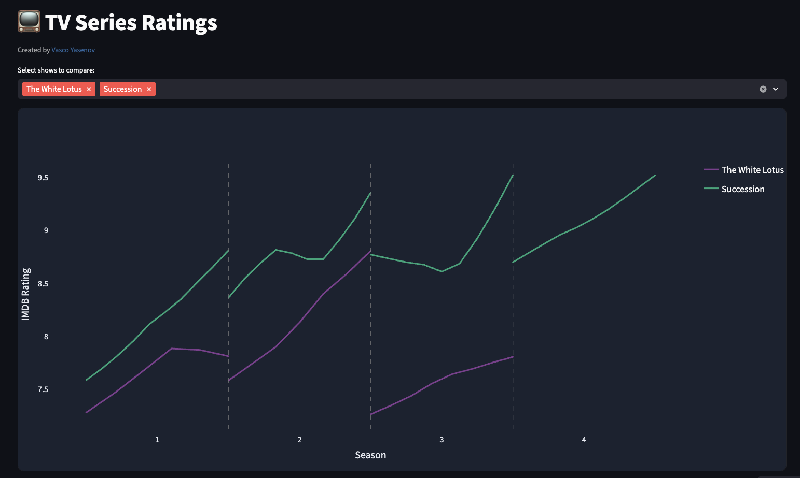
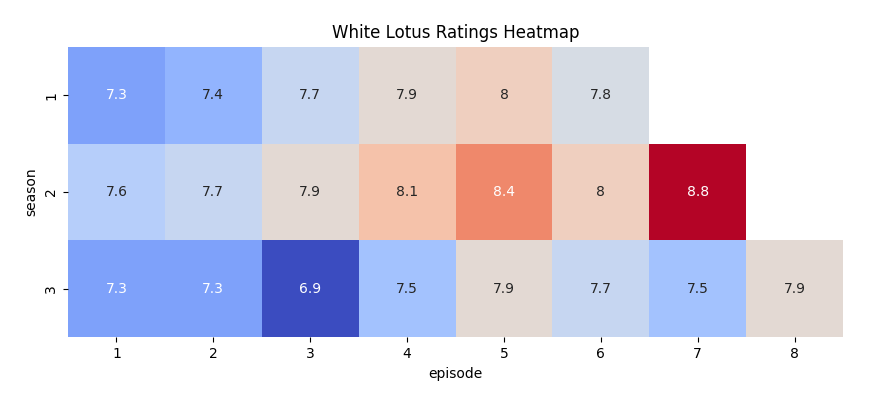
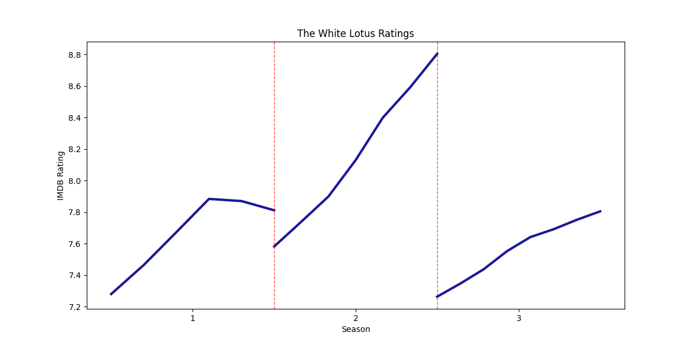

# tv-series-viz

Interactive visualizations of 37 TV series episodes IMDB.com ratings powered by Streamlit. You can explore the [deployed app here](https://tv-series-viz-eknffyu22xaca69wzv8av5.streamlit.app/). It lets you compare shows side-by-side on a normalized season timeline with LOWESS smoothing. 

This git repo contains the code to replicate the viz on your machine and gives instructions to add more shows to the database. Utility scripts can also generate static heatmaps and time series PNGs.

### Quick start

Requires Python 3.10+.

```bash
# 1) Install dependencies
pip install -r requirements.txt

# 2) Run the Streamlit app
streamlit run code/streamlit_app.py
```

Then open the URL from the terminal (typically `http://localhost:8501`).

Two of my favorite TV shows are The White Lotus (HBO) and Succession (HBO). This is what the visualization looks like for these two series. 



The upward sloping lines (albeit partly due to bias) are striking!

### Data format

CSV files live in `data/` and must follow this naming pattern and schema:

- Filename: `<show_name>_ratings.csv` (lowercase with underscores)
- Columns: `episode, season, rating`

The app automatically discovers available shows by scanning `data/` for files ending with `_ratings.csv`.

To add a new show: 

1. Create `data/<your_show>_ratings.csv` with the schema above.
2. Run or refresh the app. The show will appear in the selector automatically.

### Static graphs

You can create PNGs in `graphs/` using the helper scripts:

```bash
# Heatmaps per show (saved to graphs/heatmaps/)
python code/heatmaps.py
```

Here is how this looks like for The White Lotus:



```bash
# Time series per show (saved to graphs/time_series/)
python code/time_series.py
```

This is the plot for the same show:



### Notes

- I only included TV series with six or fewer seasons. Unfortunately, this includes some major shows like Game of Thrones, Mad Men, Orange is the New Black, etc.
- This dataset contains biases much like any other ratings data. For instance, keep in mind the "survivorship bias" whereby one rates the later episodes within a season (or seasons within a show) *only* if they like it enough to keep going. 
- The app uses absolute paths relative to the repository to find `data/`.
- LOWESS smoothing is provided by `statsmodels`.
- Plotly color palettes are chosen to work well on dark backgrounds.
